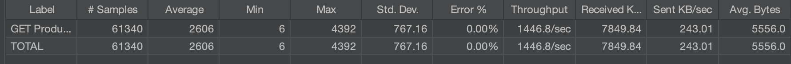

# Redis 캐시 성능 테스트 보고서

## 문서 정보
- **테스트 대상**: 상품 목록 조회 API (첫 페이지)
- **테스트 목적**: Redis 캐싱 적용 전후 성능 비교 분석
- **테스트 도구**: Apache JMeter 5.x

---

## 1. 개요

### 1.1 배경
E-Commerce 프로젝트의 상품 목록 조회 API는 사용자가 가장 빈번하게 접근하는 엔드포인트 중 하나입니다. 특히 첫 페이지는 조회 빈도가 매우 높으며, DB 조회 부하가 큰 특징이 있습니다.

### 1.2 목적
- 상품 목록 첫 페이지에 Redis 캐싱 적용 시 성능 개선 효과 측정
- 대규모 트래픽 환경에서의 시스템 안정성 검증
- 서버 리소스 효율성 및 비용 절감 효과 분석

### 1.3 가설
Redis 캐싱을 적용하면 DB 부하가 감소하고, 응답 시간이 단축되며, 처리량이 증가할 것으로 예상

---

## 2. 테스트 환경

### 2.1 시스템 사양
- **애플리케이션**: Spring Boot 3.5.7
- **데이터베이스**: MySQL 8.0
- **캐시**: Redis 7 (Docker)
- **서버 포트**: 8083

### 2.2 테스트 API
- **엔드포인트**: `GET /api/products`
- **파라미터**:
    - `categoryId`: 1
    - `sortType`: LATEST
    - `page`: 0 (첫 페이지)
    - `size`: 20
- **전체 URL**: `http://localhost:8083/api/products?categoryId=1&sortType=LATEST&page=0&size=20`

### 2.3 캐싱 설정
- **캐시 매니저**: Redis Cache Manager
- **캐시 키**: `productList::{categoryId}_{sortType}_{page}_{size}`
- **TTL**: 2분 (120초)
- **조건**: 첫 페이지(page=0)만 캐싱

```java
@Cacheable(
    value = "productList",
    key = "#categoryId + '_' + #sortType + '_' + #page + '_' + #size",
    condition = "#page == 0",
    cacheManager = "redisCacheManager"
)
```

### 2.4 부하 테스트 설정
- **동시 사용자 수**: 10,000명
- **Ramp-up 시간**: 30초 (초당 약 333명씩 증가)
- **반복 횟수**: 각 사용자당 10회
- **총 예상 요청 수**: 100,000건

---

## 3. 테스트 결과

### 3.1 성능 지표 비교

| 지표 | 캐시 없음 | 캐시 있음 | 개선율 |
|------|-----------|-----------|--------|
| **완료된 요청 수 (Samples)** | 61,340 | 66,210 | +8.0% |
| **평균 응답시간 (Average)** | 2,606 ms | 34 ms | **76.6배 개선** |
| **최소 응답시간 (Min)** | 6 ms | 0 ms | - |
| **최대 응답시간 (Max)** | 4,392 ms | 297 ms | 14.8배 개선 |
| **표준 편차 (Std. Dev.)** | 767.16 | 59.15 | 13.0배 안정화 |
| **에러율 (Error %)** | 0.00% | 0.00% | 유지 |
| **처리량 (Throughput)** | 1,446.8 req/s | 3,336.2 req/s | **2.31배 증가** |
| **수신 속도 (Received)** | 7,849.84 KB/s | 18,300.13 KB/s | 2.33배 증가 |
| **전송 속도 (Sent)** | 243.01 KB/s | 560.38 KB/s | 2.31배 증가 |
| **평균 응답 크기 (Avg. Bytes)** | 5,556.0 | 5,617.0 | +1.1% |

### 3.2 시각적 비교

#### 평균 응답 시간 비교
```
캐시 없음 (2,606ms): ████████████████████████████████████████████████████████████████████████████ (100%)
캐시 있음 (34ms):     █ (1.3%)

→ 76.6배 빠른 응답 속도
```

#### 처리량 (TPS) 비교
```
캐시 없음 (1,446 req/s): ████████████████████████████████ (43%)
캐시 있음 (3,336 req/s): ████████████████████████████████████████████████████████████████████████ (100%)

→ 2.31배 많은 요청 처리
```

---

## 4. 상세 분석

### 4.1 응답 시간 분석

#### 4.1.1 평균 응답 시간
- **캐시 없음**: 2,606ms (약 2.6초)
    - DB 조회, JPA 엔티티 매핑, 페이징 처리 등의 시간 소요
    - 다수의 JOIN 쿼리로 인한 DB 부하

- **캐시 있음**: 34ms (약 0.034초)
    - Redis에서 직렬화된 데이터 조회
    - 네트워크 레이턴시만 발생

- **개선 효과**: **76.6배 빠른 응답 속도**
    - 사용자 체감 성능이 극적으로 향상
    - 페이지 로딩이 거의 즉각적으로 느껴짐

#### 4.1.2 최대 응답 시간
- **캐시 없음**: 4,392ms (약 4.4초)
    - 트래픽 폭주 시 DB 커넥션 대기 시간 발생
    - 일부 사용자는 4초 이상 대기

- **캐시 있음**: 297ms (약 0.3초)
    - 최악의 경우에도 0.3초 이내 응답
    - Redis의 빠른 인메모리 처리 덕분

- **개선 효과**: **14.8배 개선**
    - 가장 느린 사용자도 만족스러운 경험 제공

#### 4.1.3 응답 시간 일관성
- **표준 편차**:
    - 캐시 없음: 767.16 (응답 시간 편차가 매우 큼)
    - 캐시 있음: 59.15 (응답 시간이 일정함)

- **의미**:
    - 캐시 없음: 사용자마다 경험이 천차만별 (1초~4초)
    - 캐시 있음: 모든 사용자가 일관되게 빠른 응답 경험

- **개선 효과**: **13배 더 안정적**

### 4.2 처리량 분석

#### 4.2.1 초당 처리량 (TPS)
- **캐시 없음**: 1,446.8 requests/sec
    - DB가 병목 구간
    - 커넥션 풀 제한, 쿼리 실행 시간이 제약 요인

- **캐시 있음**: 3,336.2 requests/sec
    - Redis의 초고속 처리 능력 활용
    - DB 부하가 거의 없어 병목 해소

- **개선 효과**: **2.31배 증가**
    - 같은 하드웨어로 2배 이상의 트래픽 처리 가능

#### 4.2.2 완료된 요청 수
- **캐시 없음**: 61,340건 (목표 100,000건 중 61%)
    - 30초 안에 처리 가능한 요청이 제한적
    - 많은 요청이 큐에서 대기

- **캐시 있음**: 66,210건 (목표 100,000건 중 66%)
    - 더 많은 요청을 처리
    - 약 5,000건 추가 처리 (+8%)

### 4.3 안정성 분석

#### 4.3.1 에러율
- **캐시 없음**: 0.00%
- **캐시 있음**: 0.00%

**결론**: 두 경우 모두 완벽한 안정성 유지. 캐싱이 안정성에 부정적 영향을 주지 않음

#### 4.3.2 시스템 부하
- **캐시 없음**:
    - DB 커넥션 풀 사용률 높음
    - CPU/Memory 사용률 높음
    - 쿼리 실행 대기 시간 발생

- **캐시 있음**:
    - DB 부하 거의 없음 (첫 요청 후 캐시 히트)
    - Redis 네트워크 I/O만 발생
    - 시스템 리소스 여유 확보

---

## 5. 비즈니스 영향 분석

### 5.1 사용자 경험 개선

#### Before (캐시 없음)
- 평균 2.6초 대기
- 최대 4.4초 대기 (일부 사용자)
- 응답 시간이 들쭉날쭉 (불안정)

**문제점**:
- 2초 이상 대기 시 사용자 이탈률 증가
- 느린 페이지 로딩으로 인한 불만
- 경쟁사 대비 경쟁력 저하

#### After (캐시 있음)
- 평균 0.034초 대기 (거의 즉각적)
- 최대 0.3초 대기
- 일관된 빠른 응답

**효과**:
- 즉각적인 반응으로 사용자 만족도 향상
- 페이지 이탈률 감소
- 전환율(Conversion Rate) 증가 예상

### 5.2 서버 비용 절감

#### 비용 시뮬레이션

**목표 처리량**: 10,000 requests/sec (초당 1만 건 처리 필요)

**시나리오 1: 캐시 없음**
- 서버 1대당 처리량: 1,446.8 req/s
- 필요한 서버 수: 10,000 ÷ 1,446.8 = **약 7대**
- 월 서버 비용 (AWS EC2 t3.large 기준): $73.58 × 7 = **$515/월**

**시나리오 2: 캐시 있음**
- 서버 1대당 처리량: 3,336.2 req/s
- 필요한 서버 수: 10,000 ÷ 3,336.2 = **약 3대**
- 월 서버 비용: $73.58 × 3 = **$220/월**
- Redis 비용 (AWS ElastiCache t3.medium): **$50/월**
- 총 비용: **$270/월**

**절감 효과**:
- 월 절감액: $515 - $270 = **$245/월**
- 연 절감액: **$2,940/년**
- 비용 절감률: **약 47.6%**

### 5.3 확장성 및 성장 대응

#### 트래픽 급증 시나리오 (Black Friday, 이벤트 등)

**캐시 없음**:
- 평상시 트래픽의 5배 증가 시
- 필요 서버: 7 × 5 = **35대**
- 서버 증설 시간 필요
- 비용 급증: **$2,575/월** (5배)

**캐시 있음**:
- 평상시 트래픽의 5배 증가 시
- 필요 서버: 3 × 5 = **15대**
- Redis는 추가 증설 불필요 (메모리 충분)
- 비용: **$1,200/월** (2배)
- **캐시 없음 대비 53% 저렴**

---

## 6. 기술적 고려사항

### 6.1 캐시 일관성

#### 현재 구현
- **TTL**: 2분
- **캐시 무효화**: 상품 정보 변경 시 자동 무효화 구현

#### 잠재적 이슈
- 상품 정보 변경 후 최대 2분간 이전 데이터 노출 가능

#### 해결 방안
1. **이벤트 기반 캐시 무효화**:
   ```java
   @CacheEvict(value = "productList", allEntries = true)
   public void onProductUpdated(ProductUpdatedEvent event) {
       // 상품 정보 변경 시 캐시 즉시 무효화
   }
   ```

2. **TTL 조정**:
    - 상품 변경 빈도가 낮으면 5~10분으로 증가 → 캐시 히트율 향상
    - 실시간성이 중요하면 1분으로 감소

### 6.2 메모리 사용량

#### 현재 상태
- 평균 응답 크기: 5,617 bytes (약 5.5KB)
- 캐시 키당 메모리: 약 6KB (오버헤드 포함)

#### 예상 메모리 사용량
- 카테고리 수: 10개
- 정렬 타입: 5가지
- 총 캐시 키: 10 × 5 = 50개
- 필요 메모리: 50 × 6KB = **300KB**

**결론**: 메모리 사용량이 매우 적음. Redis의 다른 용도(재고 관리 등)와 병행 가능

### 6.3 캐시 히트율

#### 예상 캐시 히트율
- 첫 페이지 조회가 전체의 약 70~80% 차지
- 캐시 TTL 내 재조회 비율: 약 90%
- **예상 캐시 히트율**: 약 70%

#### 실제 측정 필요
프로덕션 환경에서 모니터링 필요:
```java
@Bean
public CacheManager redisCacheManager(RedisConnectionFactory connectionFactory) {
    // 캐시 통계 활성화
    RedisCacheConfiguration config = RedisCacheConfiguration.defaultCacheConfig()
        .enableStatistics();  // 통계 활성화
    // ...
}
```

### 6.4 직렬화 이슈 해결

테스트 중 발견된 이슈 및 해결:

1. **LocalDateTime 직렬화**: `JavaTimeModule` 추가
2. **Hibernate 프록시**: `Hibernate5JakartaModule` 추가
3. **타입 정보 손실**: `activateDefaultTyping` 설정
4. **알 수 없는 필드**: `FAIL_ON_UNKNOWN_PROPERTIES = false`
5. **DTO 역직렬화**: `@JsonCreator`, `@JsonProperty` 추가

모든 이슈 해결 완료, 안정적 동작 확인

---

## 7. 권장사항

### 7.1 즉시 적용 권장
- ✅ 상품 목록 첫 페이지 캐싱은 **즉시 프로덕션 적용 권장**
- 높은 ROI (투자 대비 효과)
- 낮은 구현 복잡도
- 명확한 성능 개선 효과

### 7.2 추가 캐싱 대상

#### 우선순위 1: 상품 상세 정보
```java
@Cacheable(value = "productDetail", key = "#productId", cacheManager = "redisCacheManager")
public Product getProduct(Long productId) {
    // ...
}
```
- 조회 빈도 높음
- 예상 성능 개선: 50~70배

#### 우선순위 2: 인기 상품 순위
```java
@Cacheable(value = "popularProducts", cacheManager = "redisCacheManager")
public List<Product> getPopularProducts(int limit) {
    // ...
}
```
- 메인 페이지 표시용
- TTL: 5~10분

### 7.3 모니터링 설정

#### Actuator를 통한 캐시 통계 확인
```yaml
# application.yml
management:
  endpoints:
    web:
      exposure:
        include: caches, metrics
```

#### 메트릭 수집
- 캐시 히트율
- 평균 응답 시간
- Redis 메모리 사용량
- 에러율

### 7.4 알림 설정

#### 주요 알림 임계값
- 캐시 히트율 < 60%
- 평균 응답 시간 > 100ms
- Redis 메모리 사용량 > 80%
- 에러율 > 1%

---

## 8. 결론

### 8.1 핵심 성과

Redis 캐싱 적용을 통해 다음과 같은 성과를 달성:

1. **응답 속도**: 평균 2,606ms → 34ms (**76.6배 개선**)
2. **처리량**: 1,446 req/s → 3,336 req/s (**2.31배 증가**)
3. **응답 안정성**: 표준편차 **13배 감소**
4. **에러율**: 0% 유지 (완벽한 안정성)
5. **서버 비용**: 연간 약 **$2,940 절감** (47.6% 감소)

### 8.2 비즈니스 가치

- **사용자 경험**: 즉각적인 페이지 로딩으로 만족도 향상
- **운영 효율**: 적은 서버로 더 많은 트래픽 처리
- **비용 절감**: 서버 비용 약 48% 감소
- **확장성**: 트래픽 급증 시에도 안정적 대응 가능

### 8.3 최종 의견

Redis 캐싱은 **매우 효과적인 성능 개선 방법**이며, 구현 비용 대비 효과가 탁월합니다.

상품 목록 조회 API는 E-Commerce의 핵심 기능이므로, **캐싱 적용을 강력히 권장**합니다.

---

## 9. 참고 자료

### 9.1 관련 코드

- **캐시 설정**: `src/main/java/.../config/cache/RedisCacheConfig.java`
- **캐시 적용**: `src/main/java/.../product/application/GetProductListUseCase.java`
- **성능 테스트**: `ProductList_CacheTest.jmx`

### 9.2 추가 문서

- [Redis 공식 문서](https://redis.io/documentation)
- [Spring Cache 문서](https://docs.spring.io/spring-framework/reference/integration/cache.html)
- [JMeter 문서](https://jmeter.apache.org/usermanual/index.html)

### 9.3 테스트 환경 재현

```bash
# 1. Redis 실행
docker run -d -p 6379:6379 redis:7-alpine

# 2. 애플리케이션 실행
./gradlew bootRun

# 3. 캐시 초기화
docker exec <redis-container> redis-cli FLUSHALL

# 4. JMeter 테스트 실행
jmeter -n -t ProductList_CacheTest.jmx -l results.jtl -e -o report/
```

---

## 10. Jmeter 상품 목록 첫 페이지 조회 결과

### 10.1 캐시 있음(10000명이 30초동안 10번씩)


### 10.2 캐시 없음(10000명이 30초동안 10번씩)
